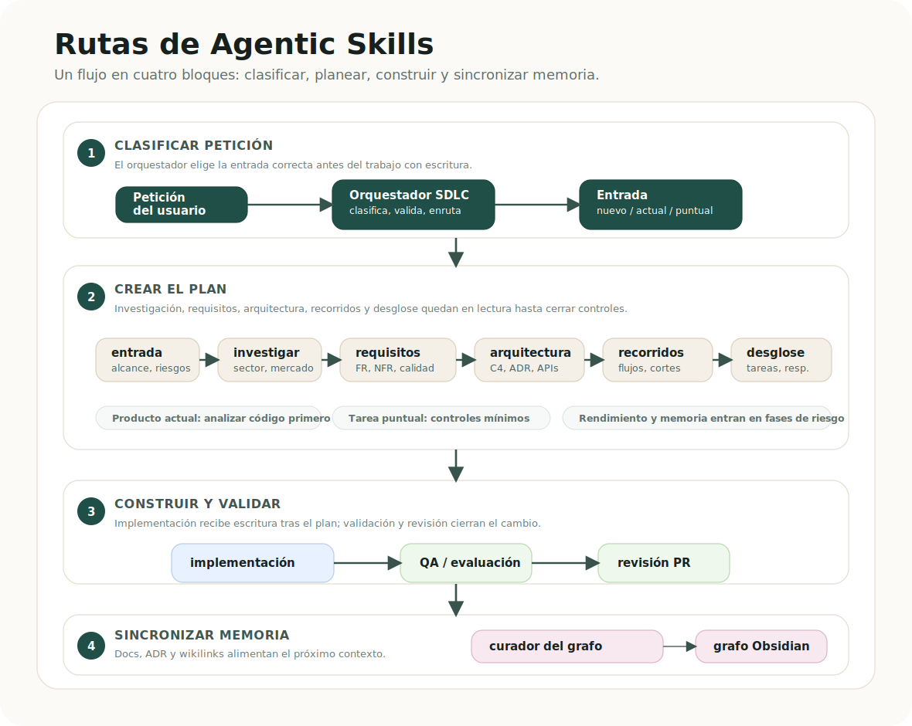

# Agentic Skills: documentación en español

[English README](../../README.md) | [Русский](README.ru.md) | [中文](README.zh.md)

Agentic Skills es un paquete profesional de skills y routing para desarrollo con agentes de IA. Ayuda a Codex, Claude Code y agentes locales a pasar de una idea a una implementación mediante fases claras: intake, investigación, requisitos, arquitectura, descomposición, implementación, QA, revisión y memoria del proyecto.



## Inicio rápido 🚀

```bash
./install.sh --global
python3 agentic/scripts/validate.py
```

Instalar solo en un proyecto local:

```bash
./install.sh --local /path/to/project --target all
```

## Cómo está organizado

- `AGENTS.md`, `CLAUDE.md`, `.claude/rules/*`: reglas permanentes del proyecto.
- `agentic/skills/`: skills activadas bajo demanda.
- `agentic/routing/skills.json`: grafo explícito de routing.
- `agentic/obsidian/project-skeleton/`: estructura de memoria del proyecto en Obsidian.
- `agentic/docs/`: documentación extendida, traducciones y assets.

## Ruta principal

1. `sdlc-orchestrator` clasifica el trabajo.
2. `intake-coordinator` define alcance, restricciones y criterios de éxito.
3. Para productos nuevos, ejecuta investigación de dominio, análisis competitivo y requisitos.
4. Para productos existentes, empieza con `analyze-codebase` en modo read-only.
5. `architecture-review`, `user-journey-mapper` y `decompose-work` preparan la implementación.
6. `service-implementation` escribe solo dentro de un scope claro.
7. `qa-eval`, `pr-review` y `documentation-graph-curator` cierran validación y memoria.

## Por qué importa

El sistema no promete un agente mágico. Construye un pipeline operativo con artefactos, gates, ownership y handoffs verificables, para que el agente sepa cuándo planear, cuándo escribir y cuándo actualizar la memoria del proyecto.

## Skills

| Skill | Qué hace |
| --- | --- |
| `sdlc-orchestrator` | Elige ruta, gates y siguiente skill. |
| `intake-coordinator` | Convierte una petición vaga en un brief accionable. |
| `research-domain` | Investiga dominio, usuarios y restricciones. |
| `competitive-analysis` | Compara competidores y alternativas. |
| `requirements-quality` | Convierte el alcance en requisitos verificables. |
| `analyze-codebase` | Reconstruye arquitectura actual en modo read-only. |
| `architecture-review` | Define arquitectura, contratos y ADR. |
| `user-journey-mapper` | Mapea story maps, journeys, flujos alternativos y release slices antes de la descomposición. |
| `decompose-work` | Divide el trabajo en tasks y parallel lanes. |
| `service-implementation` | Implementa tareas con scope claro. |
| `perf-and-memory` | Revisa riesgos de rendimiento y memoria. |
| `qa-eval` | Valida tests, acceptance y release readiness. |
| `pr-review` | Revisa regresiones y riesgos antes de merge. |
| `documentation-graph-curator` | Mantiene Obsidian graph y documentación. |
