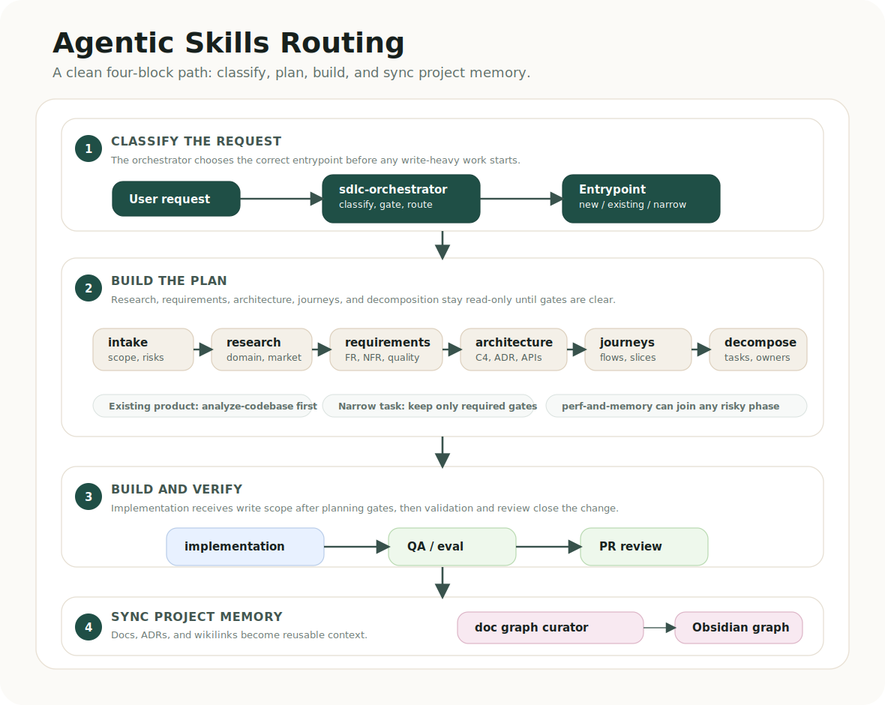

# Documentation

- [English README](../../README.md)
- [Русский](README.ru.md)
- [Español](README.es.md)
- [中文](README.zh.md)
- [Research note](research-summary.md)
- [Routing guide](../routing/README.md)

For high-risk or cross-cutting work, the system applies a principal-level bar: current documentation evidence, explicit decision trace, validation ladder, rollback, and a clean handoff before write-heavy implementation.

## Prerequisites

- Codex, Claude Code, or another MCP-compatible agent environment.
- Context7 MCP configured as `context7`/`mcpcontext7` for current library, framework, API, CLI, and platform documentation.
- Project-memory storage such as Obsidian is recommended for generated notes and graph links.
