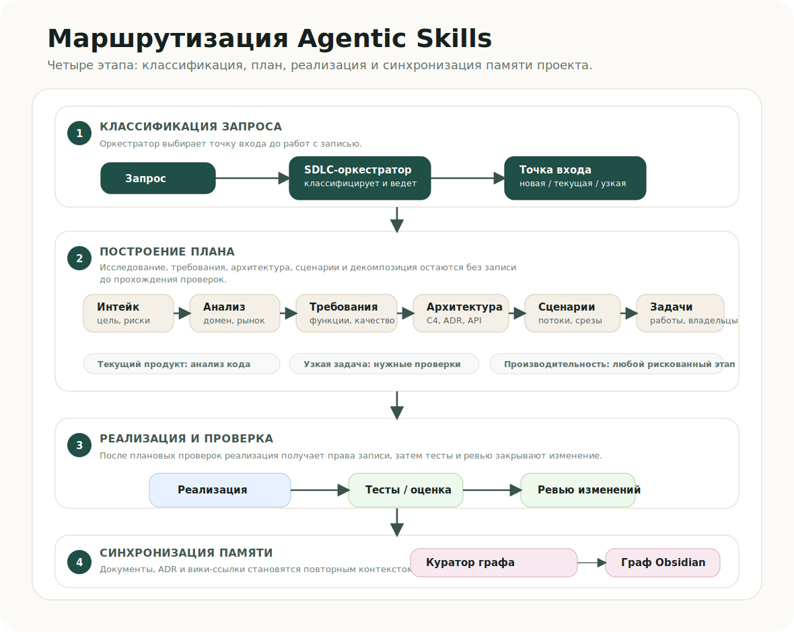

# Agentic Skills: русская документация

[English README](../../README.md) | [Español](README.es.md) | [中文](README.zh.md)

Agentic Skills — это набор правил, навыков и маршрутов для разработки с AI-агентами. Его задача простая: не давать агенту прыгать в код без контекста. Сначала он понимает запрос, выбирает маршрут, фиксирует артефакты, потом пишет код в понятной зоне ответственности, проверяет результат и обновляет память проекта.



## Быстрый старт 🚀

```bash
./install.sh --global
python3 agentic/scripts/validate.py
```

Установка только в один проект:

```bash
./install.sh --local /path/to/project --target all
```

Глобальная установка учитывает окружение: `CODEX_HOME`, `CLAUDE_HOME` и `AGENTS_HOME`. Если переменные не заданы, используются стандартные каталоги в `$HOME`.

## Что внутри

- `AGENTS.md`, `CLAUDE.md`, `.claude/rules/*`: постоянные правила для агентов.
- `agentic/skills/`: навыки, которые подключаются под конкретную задачу.
- `agentic/routing/skills.json`: явная карта маршрутов и разрешений.
- `agentic/obsidian/project-skeleton/`: каркас проектной памяти в Obsidian.
- `agentic/docs/`: документация, переводы и схемы.

## Основной маршрут

1. `sdlc-orchestrator` определяет тип задачи и выбирает маршрут.
2. `intake-coordinator` фиксирует цель, ограничения, риски и критерии готовности.
3. Новый продукт проходит discovery, требования, архитектуру и карту пользовательских сценариев.
4. Существующий продукт сначала разбирается через read-only `analyze-codebase`.
5. `architecture-review`, `user-journey-mapper` и `decompose-work` превращают замысел в понятные задачи.
6. `service-implementation` пишет код только после согласованных границ и контрактов.
7. `qa-eval`, `pr-review` и `documentation-graph-curator` закрывают проверку, ревью и проектную память.

## Почему это важно

Без маршрутизации агент быстро смешивает роли: одновременно планирует, пишет, спорит сам с собой и забывает обновить контекст. Здесь вместо этого есть рабочий контур: понятные фазы, права на запись только после проверок, владельцы задач, ревью и синхронизация с Obsidian. Получается не “магический агент”, а управляемая система разработки.

## Навыки

| Skill | Что делает |
| --- | --- |
| `sdlc-orchestrator` | Выбирает маршрут, проверки и следующий skill. |
| `intake-coordinator` | Превращает сырой запрос в рабочий brief. |
| `research-domain` | Собирает доменный контекст, пользователей и ограничения. |
| `competitive-analysis` | Сравнивает конкурентов и альтернативы. |
| `requirements-quality` | Делает требования проверяемыми. |
| `analyze-codebase` | Восстанавливает текущую архитектуру в режиме без записи. |
| `architecture-review` | Готовит архитектуру, контракты и ADR. |
| `user-journey-mapper` | Описывает story map, пользовательские сценарии, альтернативные ветки и release slices. |
| `decompose-work` | Разбивает работу на задачи, зависимости и параллельные линии. |
| `service-implementation` | Реализует задачи в согласованных границах. |
| `perf-and-memory` | Разбирает риски производительности и памяти. |
| `qa-eval` | Проверяет acceptance criteria, тесты и готовность к релизу. |
| `pr-review` | Ищет регрессии, риски и пробелы перед merge. |
| `documentation-graph-curator` | Обновляет документацию и граф проекта в Obsidian. |
