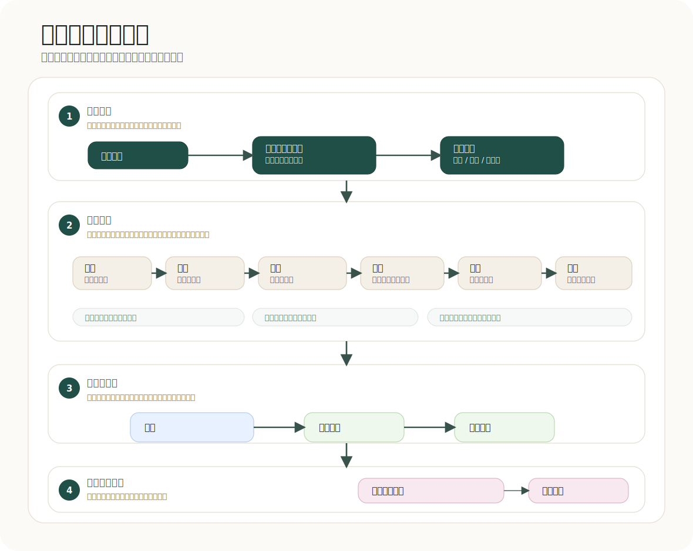

# Agentic Skills: 中文文档

[English README](../../README.md) | [Русский](README.ru.md) | [Español](README.es.md)

Agentic Skills 是一套面向 AI 软件开发代理的专业技能与路由系统。它帮助 Codex、Claude Code 和本地代理从想法走到实现，并经过清晰阶段：需求接收、领域研究、需求整理、架构设计、任务拆解、实现、QA、代码审查和项目记忆同步。



对于高风险或跨模块工作，系统采用 principal-level 标准：当前文档证据、清晰决策记录、分层验证、回滚方案，以及写入密集实现前的明确交接。

## 前置条件

- Codex、Claude Code，或其他支持 MCP 的代理环境。
- 将 Context7 MCP 配置为 `context7`/`mcpcontext7`，让代理在生成代码前获取最新的库、API、CLI、平台和配置文档。
- 建议使用 Obsidian 等项目记忆空间，用来保存笔记和图谱链接。

## 快速开始 🚀

```bash
./install.sh --global
python3 agentic/scripts/validate.py
```

只安装到某一个本地项目：

```bash
./install.sh --local /path/to/project --target all
```

## 系统结构

- `AGENTS.md`, `CLAUDE.md`, `.claude/rules/*`: 项目的长期规则。
- `agentic/skills/`: 按需调用的技能。
- `agentic/routing/skills.json`: 明确的技能路由图。
- `agentic/obsidian/project-skeleton/`: Obsidian 项目记忆骨架。
- `agentic/docs/`: 扩展文档、翻译和 assets。

## 主流程

1. `sdlc-orchestrator` 判断任务类型并选择路线。
2. `intake-coordinator` 固定范围、约束和成功标准。
3. 新产品路线会进入领域研究、竞品分析和需求整理。
4. 现有产品路线会先用 `analyze-codebase` 做只读代码考古。
5. `architecture-review`、`user-journey-mapper` 和 `decompose-work` 准备可执行的实现计划。
6. `service-implementation` 只在明确的责任边界内写代码。
7. `qa-eval`, `pr-review`, `documentation-graph-curator` 完成验证、审查和项目记忆同步。

## 为什么重要

这不是把所有事情交给一个“魔法代理”。它把软件开发变成有工件、有 gate、有 owner、有 handoff 的流程，让代理知道什么时候规划、什么时候写代码、什么时候更新项目记忆。

## Skills

| Skill | 作用 |
| --- | --- |
| `sdlc-orchestrator` | 选择路线、gate 和下一个 skill。 |
| `intake-coordinator` | 把模糊请求变成可执行 brief。 |
| `research-domain` | 研究领域、用户和约束。 |
| `competitive-analysis` | 比较竞品和替代方案。 |
| `requirements-quality` | 把范围转成可验证需求。 |
| `analyze-codebase` | 只读重建现有架构和风险点。 |
| `architecture-review` | 设计架构、契约和 ADR。 |
| `user-journey-mapper` | 在拆解前梳理 story map、用户旅程、备选流程、失败流程和发布切片。 |
| `decompose-work` | 拆分 tasks 和并行工作线。 |
| `service-implementation` | 在明确 scope 内实现代码。 |
| `perf-and-memory` | 处理性能和内存风险。 |
| `qa-eval` | 验证 tests、acceptance 和 release readiness。 |
| `pr-review` | merge 前检查回归和风险。 |
| `documentation-graph-curator` | 维护 Obsidian graph 和文档。 |
