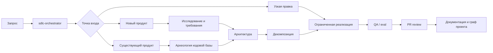
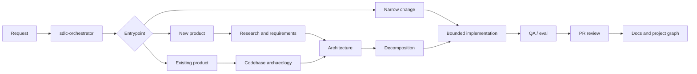

# Skill Routing

  <a href="#русский">Русский</a>
  |
  <a href="#english">English</a>

## Русский

Роутинг описывает, какой skill включается на каком этапе разработки. Он нужен, чтобы агент не смешивал исследование, архитектуру, реализацию, QA и документацию в один неуправляемый поток.

Источник для машинного чтения: `agentic/routing/skills.json`.

### Принципы

- Широкая задача сначала проходит через `sdlc-orchestrator`.
- Исследование, planning, code archaeology, architecture, decomposition, QA и review по умолчанию read-only.
- Реализация начинается через `service-implementation` только после понятных требований, ownership, contracts и validation pack.
- Параллельные агенты допускаются только после фиксации write scopes, interfaces, dependency order и merge order.
- Obsidian wikilinks являются источником графа. Mermaid только визуализирует уже зафиксированные связи.

### Карта

### Точки входа

| Точка входа | Порядок skills |
| --- | --- |
| Новый продукт | `sdlc-orchestrator` -> `intake-coordinator` -> `research-domain` -> `competitive-analysis` -> `requirements-quality` -> `architecture-review` -> `user-journey-mapper` -> `decompose-work` -> `service-implementation` -> `qa-eval` -> `documentation-graph-curator` |
| Улучшение существующего продукта | `sdlc-orchestrator` -> `analyze-codebase` -> `requirements-quality` -> `architecture-review` -> `user-journey-mapper` -> `decompose-work` -> `service-implementation` -> `qa-eval` -> `documentation-graph-curator` |
| Узкая правка | `intake-coordinator` -> `service-implementation` -> `qa-eval` -> `pr-review` -> `documentation-graph-curator` |
| Только review | `pr-review` |
| Синхронизация документации | `documentation-graph-curator` |

## English

Routing defines which skill owns each development phase. It keeps research, architecture, implementation, QA, and documentation from collapsing into one unmanaged stream.

Machine-readable source: `agentic/routing/skills.json`.

### Principles

- Broad work starts with `sdlc-orchestrator`.
- Research, planning, code archaeology, architecture, decomposition, QA, and review are read-only by default.
- Implementation starts through `service-implementation` only after requirements, ownership, contracts, and validation pack are clear.
- Parallel agents are allowed only after write scopes, interfaces, dependency order, and merge order are explicit.
- Obsidian wikilinks are the graph source of truth. Mermaid only visualizes relationships already captured in notes.

### Map

### Entrypoints

| Entrypoint | Skill order |
| --- | --- |
| New product | `sdlc-orchestrator` -> `intake-coordinator` -> `research-domain` -> `competitive-analysis` -> `requirements-quality` -> `architecture-review` -> `user-journey-mapper` -> `decompose-work` -> `service-implementation` -> `qa-eval` -> `documentation-graph-curator` |
| Existing product improvement | `sdlc-orchestrator` -> `analyze-codebase` -> `requirements-quality` -> `architecture-review` -> `user-journey-mapper` -> `decompose-work` -> `service-implementation` -> `qa-eval` -> `documentation-graph-curator` |
| Narrow code change | `intake-coordinator` -> `service-implementation` -> `qa-eval` -> `pr-review` -> `documentation-graph-curator` |
| Review only | `pr-review` |
| Documentation sync | `documentation-graph-curator` |
